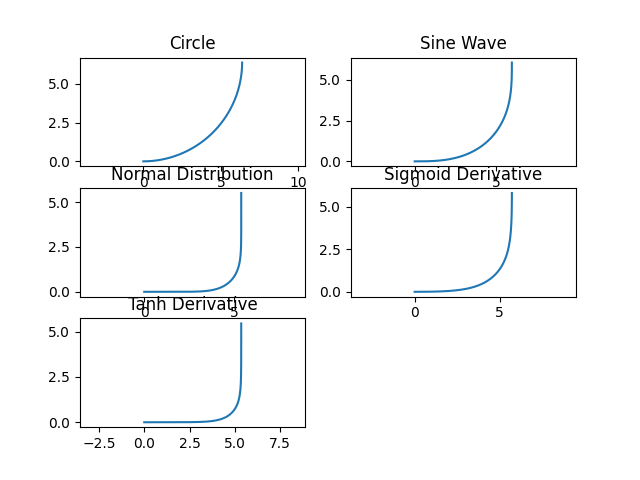

# 곡률(Curvature) 가지고 끄적여본 것

## `CurvatureManager.py`

- **kappa:** 접선 벡터 T(s)로 곡률을 계산하는 함수
- **reverse_kappa:** 곡률로 곡선을 복원하는 함수
- **curvature_to_curve:** 예제 통일을 위한 함수

### 예제

여러가지 함수들로 곡선을 만듦

## `NormalDistribution.py`

- 예제를 위해 만든 간단한 정규분포(가우스분포) 클래스
